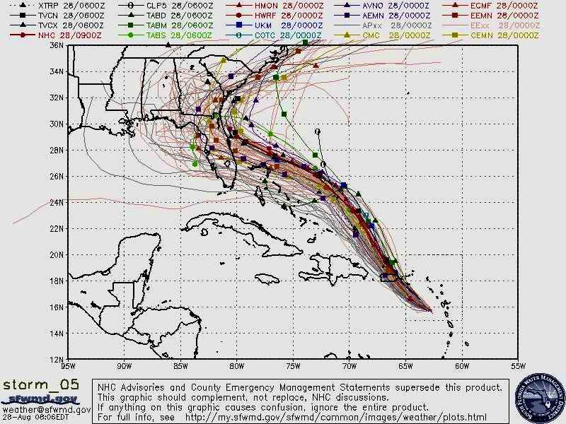
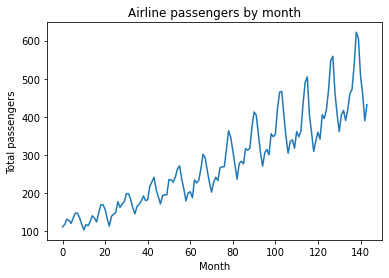
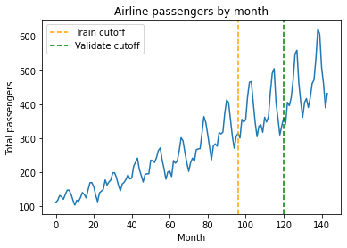

# We build forecast models so we can make plans and decisions about the future

>**Caesar:** Who is it in the press that calls on me?
I hear a tongue, shriller than all the music,
Cry 'Caesar!' Speak; Caesar is turn'd to hear.
>
>**Soothsayer:** Beware the ides of March.

~_Julius Caesar_ receives a times series forecast from his data scientist in Act I, Scene 2

Every person and organization needs to have a plan, but planning is hard because we're not sure what will happen. How much demand will there be for our product this quarter? How many people will come to our coffee shop? If we could answer these questions, we could figure out how many people to hire, how many products we'll need to make, how much coffee we should buy, etc.

Of course, people still find ways to muddle through. Generally, we make think about the likely scenarios, and plan for those. If you possess some data about the past, you can use it to make a model, and the model can tell you what scenarios you should plan for.

If you've ever lived in our near a hurricane zone (or for that matter, seen a hurricane on the news), then you've probably seen a [spaghetti plot](https://en.wikipedia.org/wiki/Spaghetti_plot). It shows all the paths that the hurricane might take, based on meterological analysis:

    
_Spaghetti plot of Hurricane Dorian. Each strand is a path that a simulated hurricane took in one of many runs of the simulation._

This is a tool for planning about an uncertain future. If a hurricane is coming to your town, you had best be ready. Organizations like FEMA need to figure out how to deploy personnel, supplies, potential evacuation orders, and other high-stakes decisions. Residents of those places need to understand how likely it is that the hurricane will appear near them. 

The spaghetti plot is a very rich diagram! First, it shows us what sort of overall path the hurricane is likely to take. Secondly, it lets us look up a specific spot on the map, and see how likely it is that a hurricane will pass through, by looking at how densely packed the paths are.

There are plenty of decisions in my life (professional and personal) where a spaghetti plot would have come in handy. In every data science job I've ever had, I've had to help stakeholders set targets and forecast future performance based on some historical data and a lot of guessing. 

In a [previous post](https://lmc2179.github.io/posts/autoreg.html), we put ourselves in the shoes of airline industry leaders, trying to use historical travel data to plan for this year's capacity by building an autoregressive (AR) model. In this post, we'll revisit that example using an expanded model (ARIMA), and generate simulations that will help in decision-making. Lets look at the time series of historical passenger totals:

```python
import pandas as pd
from matplotlib import pyplot as plt

df = pd.read_csv('https://raw.githubusercontent.com/jbrownlee/Datasets/master/airline-passengers.csv')

y = df.Passengers
n_obs = len(y)

plt.plot(y)
plt.title('Airline passengers by month')
plt.ylabel('Total passengers')
plt.xlabel('Month')
plt.show()
```



What happens next? If we knew, we could plan - airlines need things to support all those passengers, like planes, pilots, flight attendants, fuel, etc. Figuring out how much of those things we need depends on how much demand there is.

One approach is predicting where a time series will go next with an AR model, as we did last time. That model gave us $\mathbb{E}[y_t]$ and prediction bands, which can be used to identify the best case and worst case scenarios at each time point.

We'd ideally like to see a sample of all the future paths the time series could take - _predictive simulation_, which shows us the possible futures we might need to plan for. That way, we can answer questions about the entire path. Questions like:

* Over the next X months, how many passengers will fly in total?
* If we have Y% market share and $Z of revenue per passenger, what total revenue might we expect over the next X months?
* When will the total number of passengers reach X for the first time? 

Here's the game plan. We're going to:

1. Collect time series data (like the one above)
2. Fit a time series model, and demonstrate goodness of fit of that model
3. Simulate future paths to see what might happen
4. Make inferences about the simulated paths to answer questions like those above

We'll use statsmodels SARIMAX (link to it) and just the ARIMA part

# What is all this alphabet soup? Breaking down the ARIMA and SARIMAX models

_This section tries to get at some of the intuition around the models. If yo're more interested in seeing the model in action, you can skip this section and come back later._

Today, we're going to use an ARIMA model, so we'll start with that. An ARIMA model is the sum of the two ARMA components

Autoregerssige (AR) component: y_t is a function of previous observations. link post

The AR model is

$$
\underbrace{y_t^{AR}}_\textrm{Outcome at time t} \sim 
\underbrace{\alpha}_\textrm{Intercept}
+ \underbrace{(\sum_{i=1}^{p} \phi_i y_{t-i})}_\textrm{Lag terms} 
+ \underbrace{\epsilon_t}_\textrm{White Noise} 
$$

MA - $y_t$ is a function of previous innovations (?) Link to AR/MA comparison link

The MA model is

$$
\underbrace{y_t^{MA}}_\textrm{Outcome at time t} \sim 
\underbrace{\alpha}_\textrm{Intercept}
+ \underbrace{(\sum_{i=1}^{p} \phi_i \epsilon_{t-i})}_\textrm{Lag terms} 
+ \underbrace{\epsilon_t}_\textrm{White Noise} 
$$

Sometimes, it makes  more sense to predict the difference from one y to the next in which case

I - Predict $\Delta y_t$ instead; differencing

$\Delta y_t = y_t - y_{t-1}$

See https://en.wikipedia.org/wiki/Autoregressive_integrated_moving_average#Examples for some intuition on how this relates to other stuff like random walks

That means that an ARIMA model has 3 free parameters

The same class also supports SARIMAX, which has the ARIMA components plus some more of them.

[SARIMA](https://online.stat.psu.edu/stat510/lesson/4/4.1)

S - Cyclic version of ARIMA

SARIMAX = S + ARIMA + X

X - Not used, link to post and note relevant kwarg

$+ \underbrace{\beta X_t}_\textrm{Extra factors}$

# Model selection and cross-validation

We want to select a model and demonstrate prediction quality

Three-way CV split: (1) Train (2) Param. select (3) Sim quality

```python
y = df.Passengers
n_obs = len(y)

train_cutoff = 96
validate_cutoff = 120

plt.plot(y)
plt.axvline(train_cutoff, color='orange', linestyle='dashed', label='Train cutoff')
plt.axvline(validate_cutoff, color='green', linestyle='dashed', label='Validate cutoff')
plt.legend()
plt.title('Airline passengers by month')
plt.ylabel('Total passengers')
plt.xlabel('Month')
plt.show()
```



(1) Code for training

(2) Random search - Bergstrom

```python
import statsmodels.api as sm
import numpy as np
from tqdm import tqdm

# Random search for hyperparameters
n_hyperparams_to_test = 1000
max_p_val = 24
max_d_val = 1
max_q_val = 24

results = []
for i in tqdm(range(n_hyperparams_to_test)):
    params = np.random.randint(0, [max_p_val, max_d_val, max_q_val])
    p, d, q = params
    model = sm.tsa.statespace.SARIMAX(y[:train_cutoff], order=(p, d, q), trend='ct')
    try:
        model_fit = model.fit(disp=False)
    except:
        error = np.inf
    else:
        y_test_predicted = model_fit.forecast(validate_cutoff - train_cutoff)
        y_test_actual = y[train_cutoff:validate_cutoff]
        error = np.mean((y_test_actual-y_test_predicted)**2)
    results.append([error, params])
    
cv_df = pd.DataFrame(results, columns=['MSE', 'Parameters']).sort_values('MSE')
best_params = cv_df['Parameters'].iloc[0]
```

That took about 60 minutes on my machine; you can create less complex models (decrease `max_hyperparam_val`) or try fewer of them (decrease `n_hyperparams_to_test`) to reduce the size of the search space (or the opposite, if you've got more compute to spend than I do).

The best params that my run found were $(15, 0, 14)$

Okay, lets show the train and test fit

```python
# Check: Plot best model against train and test region
p, d, q = (15, 0, 14)
model = sm.tsa.statespace.SARIMAX(y[:train_cutoff], order=(p, d, q), trend='ct')
model_fit = model.fit(disp=False)

plt.plot(y)
plt.plot(model_fit.predict(end=validate_cutoff))
plt.axvline(train_cutoff, color='orange', linestyle='dashed')
plt.axvline(validate_cutoff, color='green', linestyle='dashed')
plt.legend()
plt.title('Airline passengers by month')
plt.ylabel('Total passengers')
plt.xlabel('Month')
plt.show()
```

(3) Demonstration of sim quality, ie coverage of real path of validation set

TODO: Code below should just do validation part

```python
p, d, q = (15, 0, 14)
model = sm.tsa.statespace.SARIMAX(y[:validate_cutoff], order=(p, d, q), trend='ct')
model_fit = model.fit(disp=False)

n_forecast = len(y) - validate_cutoff
n_simulations = 1000

# Container for simulated paths
simulations = np.empty((n_simulations, n_forecast))

# Simulate multiple paths. We use a loop to generate each simulation.
for i in range(n_simulations):
    simulations[i, :] = model_fit.simulate(nsimulations=n_forecast, anchor='end')

 # Plot each simulated path
for i in range(n_simulations):
    plt.plot(np.arange(validate_cutoff, validate_cutoff + n_forecast), simulations[i, :],
              label=f'Simulation {i+1}', alpha=0.01, color='grey')

# Plot observed data
plt.plot(y, color='purple')
plt.plot(model_fit.predict(end=len(y)), color='orange', linestyle='dashed')
plt.axvline(train_cutoff, color='orange', linestyle='dashed')
plt.axvline(validate_cutoff, color='green', linestyle='dashed')
plt.title('Airline passengers by month')
plt.ylabel('Total passengers')
plt.xlabel('Month')
plt.show()
```

Code - Path coverage

```python
for i in range(n_simulations):
    plt.plot(np.arange(validate_cutoff, validate_cutoff + n_forecast), simulations[i, :], alpha=0.01, color='grey')

prediction_interval_alpha = .05
predicted_lower = np.array([np.quantile(sim, (prediction_interval_alpha / 2)) for sim in simulations.T])
predicted_upper = np.array([np.quantile(sim, 1.-(prediction_interval_alpha / 2)) for sim in simulations.T])

plt.plot(np.arange(validate_cutoff, validate_cutoff + n_forecast), predicted_lower, linestyle='dotted')
plt.plot(np.arange(validate_cutoff, validate_cutoff + n_forecast), predicted_upper, linestyle='dotted')

# Plot observed data
plt.plot(y, color='purple')
plt.plot(model_fit.predict(end=len(y)), color='orange', linestyle='dashed')
plt.axvline(train_cutoff, color='orange', linestyle='dashed')
plt.axvline(validate_cutoff, color='green', linestyle='dashed')
plt.title('Airline passengers by month')
plt.ylabel('Total passengers')
plt.xlabel('Month')
plt.xlim(validate_cutoff)
plt.xlim(120, 145)
plt.ylim(300)
plt.show()
```

Pct coverage? Narrow enough to be useful?

# Training the final model and generating predicted paths

Okay, so we've selected the model (., ., .). Let's train it on the whole data set:

Code - Fitting the combined model

Code/Summary - Interpreting the combined model

Now we can make predictions. Generating simulated paths for future flight counts

```python
# Fit a SARIMAX model as an AR(2) model (order=(2, 0, 0))
model = sm.tsa.statespace.SARIMAX(y, order=(15, 0, 14))
model_fit = model.fit(disp=False)
print(model_fit.summary())

# Set simulation parameters
n_forecast = 50
n_simulations = 1000

# Container for simulated paths
simulations = np.empty((n_simulations, n_forecast))

# Simulate multiple paths. We use a loop to generate each simulation.
for i in range(n_simulations):
    simulations[i, :] = model_fit.simulate(nsimulations=n_forecast, anchor='end')

# Plot observed data
plt.figure(figsize=(12, 6))
plt.plot(np.arange(n_obs), y, label='Observed Data', color='black')

# Plot each simulated path
for i in range(n_simulations):
    plt.plot(np.arange(n_obs, n_obs+n_forecast), simulations[i, :],
              label=f'Simulation {i+1}', alpha=0.01, color='blue')

plt.xlabel('Time')
plt.ylabel('Value')
plt.title('ARIMA(15, 0, 14) Model: Observed Data and Multiple Simulated Future Paths')
#plt.legend(loc='upper left', bbox_to_anchor=(1.05, 1))
plt.tight_layout()
plt.show()
```

Code - Path samples, 99% quantiles

What do we find out? Upper and lower limits

When can we interpret this causally? When we have closed all the backdoors

# Monte Carlo analysis of the functions of the simulated paths

Often a quantity of interest is a function of the future time series

$\theta = f(x_1, ..., x_n)$

For example: Revenue assuming x% market share; Month with peak flights; amount of peak flights; when the total will reach some value; percent growth

Now that we've simulated the paths, this is easy

We can come up with an estimate of $\mathbb{E}[\theta]$ by averaging the simulated pads. We can even estimate quantiles

Other ideas: Counterfactuals/Effects of interventions/Results of decisions

# Sources and Links

https://online.stat.psu.edu/stat510/lesson/1 - Good course on time series modeling
Otext?