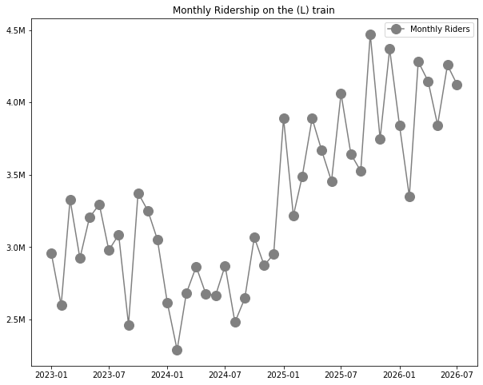
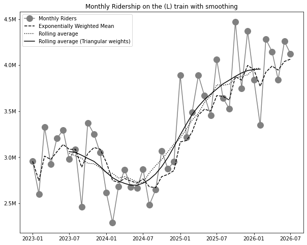
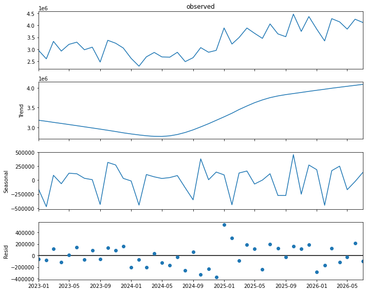
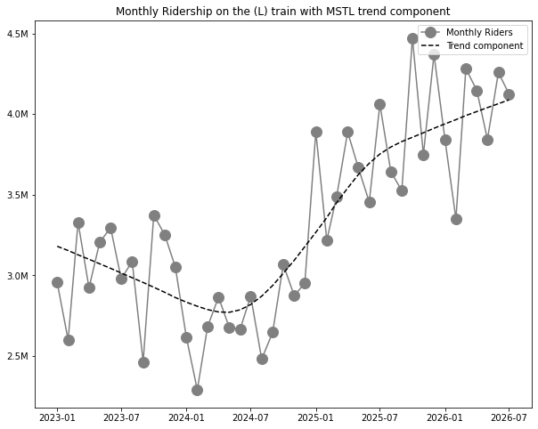
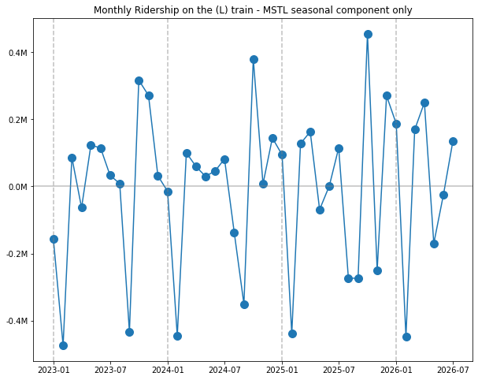
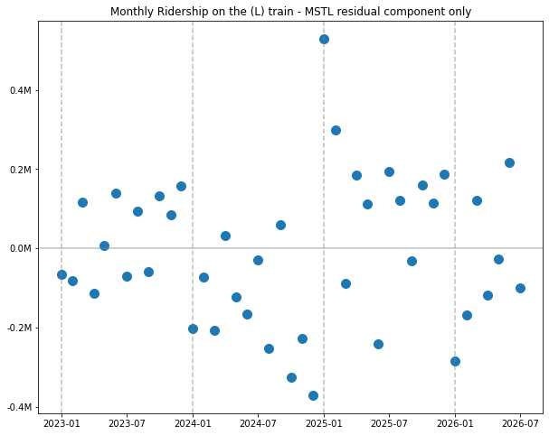

https://data.ny.gov/Transportation/MTA-Subway-Customer-Journey-Focused-Metrics-Beginn/r7qk-6tcy/about_data 

Title: Finding New York's Hottest Train with time series decomposition

# Lots of very important decisions are made by looking at time series data

A shocking number of real world decisions are made by people on a zoom call squinting at a time series chart of a metric and saying "okay, I think I know what's going on here". But do they? In their defense, a time series can be hard to read. For example, the other day as I was sitting on the subway to go to my office (where I would sit on zoom calls squinting at time series plots), I found myself wondering whether there are more people on the subway than there had been a few years ago. The subway certainly _felt_ more crowded, but maybe I'm just looking through rose tinted glasses at the New York of yesteryear (I wouldn't be the first). Had the subway ridership actually increased? That's a data question! We can grab a data set from our good friends at the MTA, and look at train ridership over time. For example, here's the **monthly ridership of the L train**, which I was commuting on:

```python
# Import the data I downloaded from https://data.ny.gov/Transportation/MTA-Daily-Ridership-Data-2020-2025/vxuj-8kew/about_data

import pandas as pd
import numpy as np
from matplotlib import pyplot as plt
import matplotlib.ticker as ticker
import seaborn as sns
from statsmodels.tsa.seasonal import MSTL

plt.rcParams["figure.figsize"] = (10, 8)

df = pd.read_csv(r'MTA_Subway_Customer_Journey-Focused_Metrics__Beginning_2015_20260829.csv')

df = df[df['month'] >= '2023-01-01']
df = df[df['period'] == 'peak']
df['num_passengers'] = df['num_passengers'].str.replace(',', '').astype(float)

# L train plot
def millions(x, pos):
    return f'{x*1e-6:.1f}M'

l_train_peak_df = df[df['line']=='L']
l_train_peak_df.index = pd.to_datetime(l_train_peak_df.month)

plt.title('Monthly Ridership on the (L) train')
plt.gca().yaxis.set_major_formatter(ticker.FuncFormatter(millions))
plt.plot(l_train_peak_df.num_passengers, marker='o', markersize=12, color='grey', label='Monthly Riders')
plt.legend()
plt.show()
```



Okay, so...hm. I do not find this to be an easy chart to read. What's the story here? It looks like it has increased, but how much? Is there a dip in the middle there? What can we say about the overall trend, other than "it looks like it's going up"? What about monthly seasonality, is that affecting how this looks?

You've probably had to deal with this before. The most common tool for dealing with this in practice is to smooth the time series with a moving average, or something similar. And it's a good solution!

# Smoothing is the most common solution, and it's a pretty good one

The idea of a moving average is simple: average each point with the ones near it in order to make the curve smoother. Sudden spikes will get smoothed out as we combine them with their neighbors. By making the window size 12, we are attempting to remove the 12 month cycle and noise, leaving just the overall long-term trend.

```python
plt.title('Monthly Ridership on the (L) train with smoothing')
plt.gca().yaxis.set_major_formatter(ticker.FuncFormatter(millions))
plt.plot(l_train_peak_df.num_passengers, marker='o', markersize=12, color='grey', label='Monthly Riders')
plt.plot(l_train_peak_df.num_passengers.ewm(alpha=0.3).mean(), color='black', linestyle='dashed', label='Exponentially Weighted Mean')
plt.plot(l_train_peak_df.num_passengers.rolling(window=12, center=True).mean(), color='black', linestyle='dotted', label='Rolling average')
plt.plot(l_train_peak_df.num_passengers.rolling(win_type='triang', window=12, center=True).mean(), color='black', linestyle='solid', label='Rolling average (Triangular weights)')
plt.legend()
plt.show()
```



That is an improvement, admittedly. It's now much easier to read, for example, that ridership started around the 3 million-ish mark and as of mid-2026 is around the 4 million-ish mark.

This solution hints that there is a smooth trend underlying the data, something like

$$Data_t = Trend_t + Month_t + Noise_t$$

or maybe if you're feeling really fancy, you might write it with Greek letters:

$$\underbrace{y_t}_\textrm{Observed} = \underbrace{\mu_t}_\textrm{Trend component} + \underbrace{\beta_t}_\textrm{Monthly component} + \underbrace{\epsilon_t}_\textrm{Noise component}$$

(For what it's worth, I recommend the Greek letter version. People are always very impressed when data scientists use Greek letters.)

We're removing the monthly cycle and the noise with our moving average, ideally leaving just the trend behind. This is a good trick, but it always feels a little brittle to me. If we had more than one seasonal cycle (for example, daily and monthly cycles), we'd have to do some work to extend our method.

It also raises a natural question - can I see the other parts of the equation, ie the monthly cycle and the noise? They might have information I could use too.

# Get the full picture by decomposing the time series with (M)STL

We can decompose the time series into its pieces using the [MSTL procedure](https://www.statsmodels.org/devel/generated/statsmodels.tsa.seasonal.MSTL.html) as [implemented in statsmodels](https://www.statsmodels.org/devel/generated/statsmodels.tsa.seasonal.MSTL.html).

MSTL stands for "Multiple Seasonal-Trend decomposition using LOESS", which is admittedly a bit of a mouthful. The method decomposes the **observed time series** into three components:

* **Trend:** The smooth long-term trajectory of the time series, with seasonal factors and noise removed.
* **Seasonal:** The cyclic behavior - in our example of month-level data, this is the 12 month cycle. The **M** in in **M**STL comes from the fact that it supports multiple seasonalities (ie, daily _and_ monthly).
* **Residual:** Everything left over. In theory, this is just normally distributed noise. In practice, examining the residuals helps us understand where the model doesn't fit well. 

It's easy to calculate this decomposition in statsmodels, and plot the different components:

```python
res = MSTL(l_train_peak_df['num_passengers'], periods=(12)).fit()

res.plot()
plt.show()
```



All of these add up to the time series we actually observed. They are our estimates of the right hand side of the equation for an additive time series we had before:

$$\underbrace{y_t}_\textrm{Observed} = \underbrace{\mu_t}_\textrm{Trend component} + \underbrace{\beta_t}_\textrm{Monthly component} + \underbrace{\epsilon_t}_\textrm{Noise component}$$

Let's look at each component separately and see what we can learn.

### Trend component

Here's the observed time series, plus the trend component:

```python
# Trend view

plt.title('Monthly Ridership on the (L) train with MSTL trend component')
plt.gca().yaxis.set_major_formatter(ticker.FuncFormatter(millions))
plt.plot(l_train_peak_df.num_passengers, marker='o', markersize=12, color='grey', label='Monthly Riders')
plt.plot(res.trend, color='black', linestyle='dashed', label='Trend component')
plt.legend()
plt.show()
```



How does the trend look?

### Seasonal component

```python
# Seasonal view

plt.title('Monthly Ridership on the (L) train - MSTL seasonal component only')
plt.gca().yaxis.set_major_formatter(ticker.FuncFormatter(millions))
plt.plot(res.seasonal, marker='o', markersize=10)
plt.axhline(0, color='grey', alpha=0.5)
for i in [0, 12, 24, 36]:
    plt.axvline(l_train_peak_df.index[i], linestyle='dashed', alpha=0.5, color='grey')
plt.show()
```



Does it tell us anything about the seasonal cycle?

October is busiest, a well documented fact https://www.nytimes.com/2013/11/21/nyregion/in-october-a-day-for-the-new-york-city-subways-ridership-record-book.html 

September is low

February is always a big dip after jan; though it is the shortest

res.seasonal/res.trend is neat too - seasonal effects cause the trend to move around -15-+10 % depending

### Residual component

```python
# Residual view

plt.title('Monthly Ridership on the (L) train - MSTL residual component only')
plt.gca().yaxis.set_major_formatter(ticker.FuncFormatter(millions))
plt.plot(res.resid, marker='o', markersize=10, linewidth=0)
plt.axhline(0, color='grey', alpha=0.5)
for i in [0, 12, 24, 36]:
    plt.axvline(l_train_peak_df.index[i], linestyle='dashed', color='grey', alpha=0.5)
plt.show()
```



What do the residuals look like?

The biggest "surprise" is a much larger ridership in Jan 2025

oh wow Congestion pricing

# Which train has increased its ridership the most?

One thing that's nice about this sort of decomposition is that it lets you analyze the trend series, or multiple trend series, to understand what has been happening over the long term. For example, we can ask a question like: **Which subway line has increased monthly ridership the most since 2023?**

We can plot the trend-only views of all the lines:

[plot of all the lines]

Okay, that's a little bit busy. Let's look at the summary table

|    | line   |     |
|---:|:-------|:----|
|  0 | JZ 🟤  |     |
|  1 | B 🟠   |     |
|  2 | D 🟠   |     |
|  3 | F 🟠   |     |
|  4 | M 🟠   |    |
|  5 | L 🔘   |     |
|  6 | 1 🔴   |     |
|  7 | 2 🔴   |     |
|  8 | 3 🔴   |     |
|  9 | 4 🟢   |     |
| 10 | 5 🟢   |     |
| 11 | 6 🟢   |     |
| 12 | G 🟢   |     |
| 13 | 7 🟣   |     |
| 14 | A 🔵   |     |
| 15 | C 🔵   |     |
| 16 | E 🔵   |     |
| 17 | N 🟡   |     |
| 18 | Q 🟡   |     |
| 19 | R 🟡   |     |
| 20 | W 🟡   |     |

The big winners are ...

# Downsides of MSTL

No standard errors - this is a big one . maybe block bootstrap could fix this

Consider building a more complex regression model, esp an ARMA model

# proof of concept

Extract details for each train. which one has seen major trend changes recently

```python
import pandas as pd

df = pd.read_csv(r'C:\Users\louis\Downloads\MTA_Subway_Customer_Journey-Focused_Metrics__Beginning_2015_20260829.csv')

df = df[df['month'] >= '2023-01-01']
df = df[df['period'] == 'peak']
df['num_passengers'] = df['num_passengers'].str.replace(',', '').astype(float)

for line, color in [('JZ', 'brown'), 
                    ('B', 'orange'), ('D', 'orange'), ('F', 'orange'), ('M', 'orange'), 
                    ('L', 'gray'), 
                    ('1', 'red'), ('2', 'red'), ('3', 'red'), 
                    ('4', 'green'), ('5', 'green'), ('6', 'green'), ('G', 'green'),
                    ('7', 'purple'),
                    ('A', 'blue'), ('C', 'blue'), ('E', 'blue'),
                    ('R', 'yellow'), ('N', 'yellow'), ('Q', 'yellow'), ('W', 'yellow'),
                    ('R', 'gray'), ]:
    line_peak_df = df[df['line']==line]
    line_peak_df.index = pd.to_datetime(line_peak_df.month)
    
    from matplotlib import pyplot as plt
    import seaborn as sns
   
    plt.rcParams["figure.figsize"] = (12, 10)
    
    from statsmodels.tsa.seasonal import MSTL, STL
    res = MSTL(line_peak_df['num_passengers'], periods=(12)).fit()
    
    plt.plot(res.trend, label=line, color=color)
    print(line, res.trend.iloc[-1] / res.trend.iloc[0] - 1)

plt.legend()
plt.show()

res.plot()
plt.show()

plt.plot(line_peak_df.num_passengers, marker='o', markersize=12)
plt.plot(line_peak_df.num_passengers.ewm(alpha=0.2).mean())
plt.show()
```